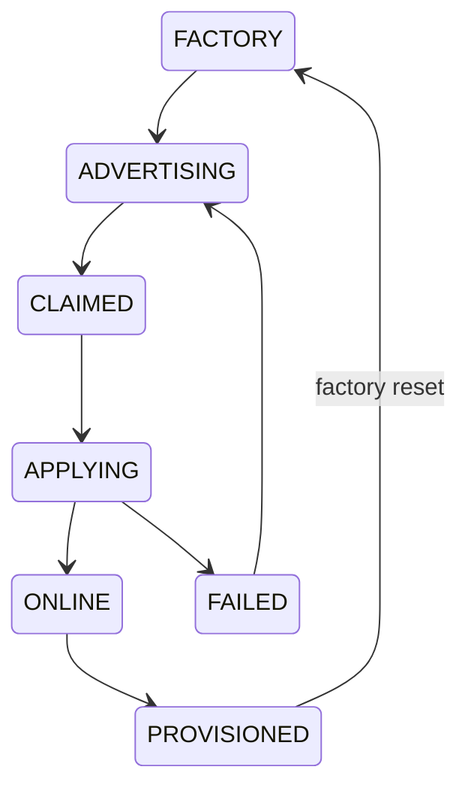

# State machines

```mermaid
stateDiagram-v2
  FACTORY --> ADVERTISING
  ADVERTISING --> CLAIMED
  CLAIMED --> APPLYING
  APPLYING --> ONLINE
  APPLYING --> FAILED
  FAILED --> ADVERTISING
  ONLINE --> PROVISIONED
  PROVISIONED --> FACTORY: factory reset
```

The app runs `idle → scan_qr → secure_channel → wifi_list → creds_entry → applying →
claimed → success`; failures return to the relevant list or password step, never QR scan.
