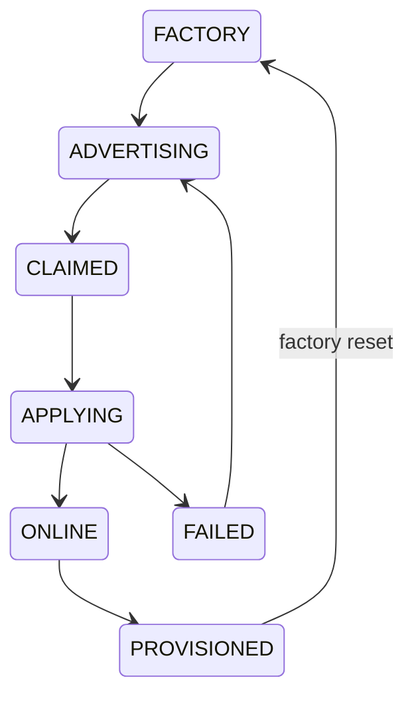

# State machines

The browser FSM is enforced by `app/src/state/machine.ts`:

`idle → scan_qr → qr_parsed → (Android+BLE: ble_request_device → ble_connecting |
iOS/no BLE: show_join_ap → portal_loaded) → secure_channel → wifi_list → creds_entry →
applying → (handoff → verifying_from_lan) → claimed → success`.

Invalid transitions throw. A `failure` state may go back only to `wifi_list` or
`creds_entry`, never `scan_qr`; individual error screens choose the applicable route.
